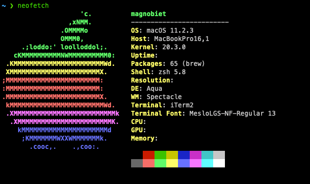

#  Magno's dotfiles




## Installation

> **Warning**: If you want to give these dotfiles a try, you should first fork this repository, review the code, and remove things you don't want or need. Don't blindly use my settings unless you know what that entails. Use at your own risk!

1. [Fork](https://github.com/magnobiet/dotfiles-macos/fork) and clone this repository on your machine
   - `git clone https://github.com/YOUR_USER_NAME/dotfiles-macos/ $HOME/.dotfiles && cd $_`
2. Replace the personal data on the following files:
   - `files/gitconfig` (lines 2 and 3)
   - `files/npmrc` (lines 1, 2 and 3)
   - `bootstrap.sh` (line 24 or 25)
3. If you don't want the Dracula theme, on `boostrap.sh` comment the line 70
4. On `apps.sh` comment or remove the apps that you don't need, the same one on `asdf.sh`

```bash
# after updating all the files above, run
./bootstrap.sh
./zsh.sh # run only if you want to use ZSH

# or just run at your own risk the following command
bash -c "`curl -fsSL https://raw.githubusercontent.com/magnobiet/dotfiles-macos/master/bootstrap.sh`"
```

## License

This project is licensed under the [MIT License](https://magno.mit-license.org/2021). Copyright © Magno Biét
